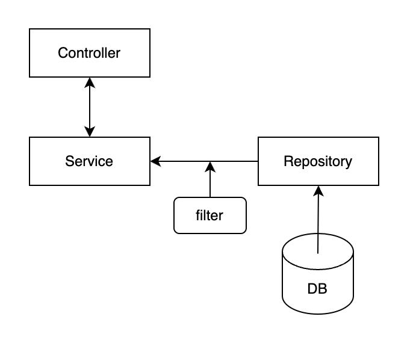

# Trade Reporting Engine

## How to run

```bash
./gradlew bootRun
```

In another terminal:
```bash
curl -X POST http://localhost:8080/trades -H "Content-Type: application/json" -d '{"filenames":["event0.xml", "event1.xml", "event2.xml"]}'
curl -X GET http://localhost:8080/trades | jq
```
or if `jq` is not installed:
```bash
curl -X GET http://localhost:8080/trades
```

## Design



- `filter` can be easily extended by adding queries with [Specifications](https://docs.spring.io/spring-data/jpa/reference/jpa/specifications.html)
- H2 is used for DB layer, it is in memory DB so when the service stop all data will be lost. It can be replaced by any other Databases.

## Note

- The service is reading XML files from `eventXmlFilesPath` which defined in `application.properties`

## Further Improvement

- The service is using blocking calls, would be better to use Reactive or CompletableFuture to get data from Repository asynchronously.
- Use multi-thread to parse XML files in parallel.
- Add tests for XmlParser, e.g. malformed XMLs.
- Use [ANTLR](https://www.antlr.org/) to make the filter to support SQL-like queries from the endpoint.

